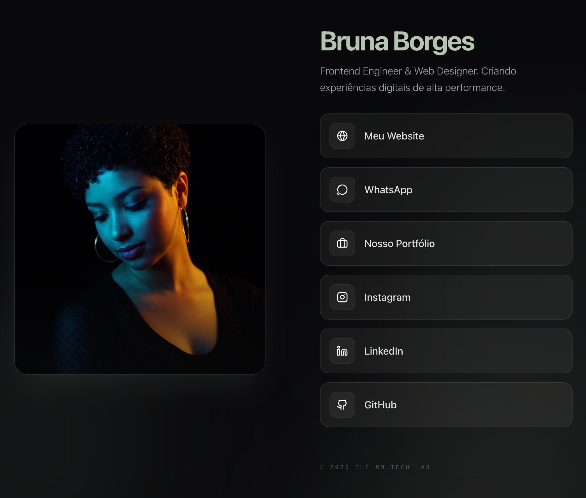

# Linktree - Bruna Borges

Check it here: [brunaborges.com/links](https://brunaborges.com/links)

### Preview

This repository contains the **architectural skeleton** of the Linktree (links page) for Bruna Borges.

### What is this?
This is a focused reference for a high-performance personal links aggregator. It demonstrates a clean, mobile-first implementation of a social landing page.

### Key Features:
- **Mobile-First Design**: Optimized for rapid loading and interaction on mobile devices.
- **Dynamic Link Mapping**: Architecture for managing social and professional links via i18n or simple data arrays.
- **Polished Entry Animations**: Implementation references for smooth entry sequences using Framer Motion.

> [!NOTE]
> This is a structural and documentation reference. The actual production deployment and private configurations are maintained in a separate repository.

---
Built by [Bruna Borges](https://brunaborges.com)
